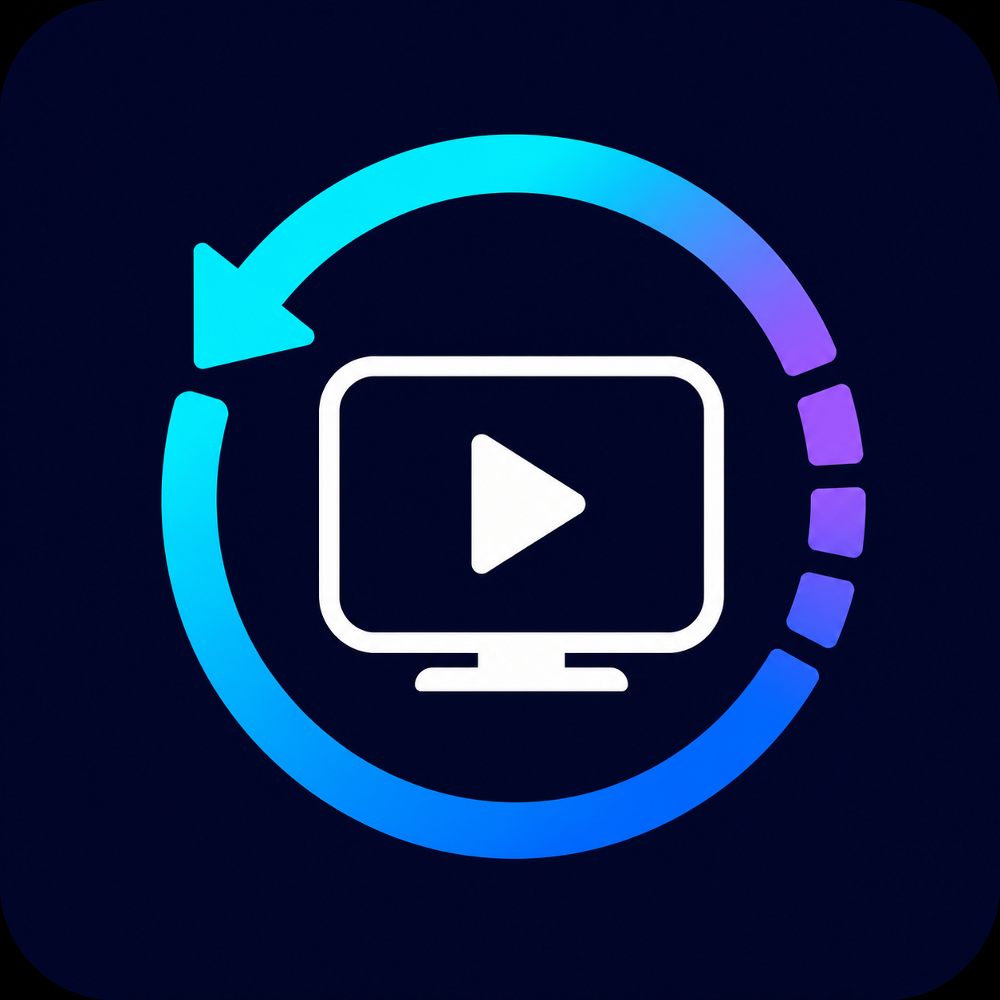

# 续映 ContinueBox



续映是一个支持多设备播放记录同步的 Android TV 播放器，基于 TVBoxOS 改造。它将播放历史和进度同步到你自己的飞牛 NAS，多台电视使用同一账号即可接着观看。

> 本项目只同步播放记录元数据，不提供、代理或存储任何影视数据源。请仅使用拥有合法权限的内容。

## 主要功能

- 多台 Android TV / 电视盒子同步播放历史、分集和进度
- 播放过程中定期上传，退出播放时立即补传
- 网络失败后保留待上传状态，下次启动自动重试
- 进入详情与历史页面时自动拉取，完成后立即刷新
- 一个客户端保存多个同步服务器账号并快速切换
- 飞牛 NAS Docker 一键部署，推荐通过 Tailscale 外网访问
- 服务端默认每个账号保留最近 30 条记录，可自行调整

## 快速部署同步服务

将 `sync-server` 目录复制到飞牛 NAS，进入目录后执行：

```sh
sh install.sh
```

脚本会生成随机密钥并启动 Docker 服务。然后在浏览器访问：

```text
http://NAS地址:8080/health
```

看到 `{"ok":true}` 即部署成功。建议先安装 Tailscale，再用 NAS 的 `100.x.x.x:8080` 地址连接；不要直接把 8080 端口暴露到公网。

## 客户端使用

1. 安装 APK，在“我的”页面打开“播放记录同步”。
2. 输入 NAS 地址（如 `100.x.x.x:8080`）、用户名和至少 8 位密码。
3. 首台设备选择注册，其他设备使用同一账号登录。
4. 各设备应使用相同数据源，影片与分集 ID 一致时才能正确合并。

首次注册完成后，建议在 `sync-server/.env` 将 `ALLOW_REGISTER` 改为 `false`，再运行 `docker compose up -d`。

## 本地构建

需要 JDK 17 与 Android SDK。Windows 示例：

```powershell
./gradlew.bat :app:assembleJava64Debug
```

APK 输出到 `app/build/outputs/apk/`。服务端测试：

```sh
cd sync-server
python -m pip install -r requirements-dev.txt
python -m pytest -q
```

## 数据与隐私

数据库位于 `sync-server/data/tvbox-sync.db`，备份整个 `data` 目录即可。账号密码使用 scrypt 加盐哈希保存，登录令牌使用服务端密钥签名。同步内容可能包含片名、分集、进度及客户端保存的历史详情，请保护 NAS 和备份文件。

## 鸣谢与许可

客户端基于 [TVBoxOS](https://github.com/q215613905/TVBoxOS) 开发，沿用原项目许可证，详见 [LICENSE](LICENSE)。第三方组件与数据源各自遵循其许可证及使用条款。

## 支持项目

如果续映对你有帮助，可以请作者喝杯咖啡：


